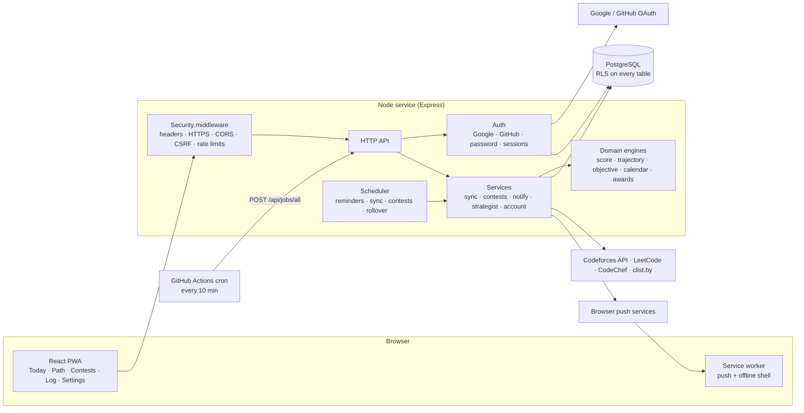

# Architecture

CAIRN is one Node service plus one PostgreSQL database. The same service serves the API and the built web app, so the browser sees a single origin and the session cookie stays same-site.



## The core loop

```
CURRENT STATE → TRAJECTORY → TODAY'S EXECUTION → NEXT → verified completion → score update → calendar → NEXT
```

1. **Current state.** Per-platform figures from synced profiles plus anything the person entered.
2. **Trajectory.** Pace from a trimmed-mean velocity over recent days, projected to the person's own target date.
3. **Today's execution.** A daily objective of per-platform quotas, planned at rollover.
4. **Next.** One suggested action, chosen from the problem pool the person has not solved.
5. **Verified completion.** An item is VERIFIED only when a platform's own data confirms it; manual entries are labelled MANUAL.
6. **Score update and calendar.** Snapshots feed the Log (calendar, awards, contest history).

## Code map

| Area | Location | Notes |
| --- | --- | --- |
| Domain engines | `server/src/domain` | Pure functions: score, trajectory, objective, calendar, awards, consistency, notifications, time. No I/O. |
| Services | `server/src/services` | Pipeline, derived state, sync, contests, notifications, scheduler, strategist, sessions, identity, account export and deletion. |
| Adapters | `server/src/adapters` | One per platform; each implements only what its source provides. |
| HTTP | `server/src/routes` | `api.ts`, `auth.ts`, `oauth.ts`, `jobs.ts`, and `security.ts` for the middleware. |
| Schema | `server/src/db/sql` | Numbered SQL migrations, applied on start. |
| Web app | `web/src` | Pages, components, copy, styles; PWA assets in `web/public`. |
| Tests | `server/test` | Domain, adapters, pipeline, multi-user isolation and security. |

## Data model in one paragraph
Global tables hold shared facts (`problems`, `contests`, `source_health`, `kv`). Every other table belongs to a user and is always resolved from the server-side session: sign-in identities, sessions, platform accounts and stats, submissions, solved problems, contest participation and commitments, rating history, score snapshots, daily objectives, activity, notifications, push subscriptions, awards and strategist notes.

## Scheduling
The server runs an in-process scheduler (reminders every minute, sync every 30 minutes, contests every two hours). Because free hosts sleep, a GitHub Actions cron also calls `POST /api/jobs/all` every 10 minutes, which wakes the service. Both paths use a database lease and `SKIP LOCKED` delivery, so a job never runs twice at once and a reminder is never sent twice.

## Related
[Deployment](DEPLOYMENT.md) · [Design](DESIGN.md) · [Decisions](DECISIONS.md) · [Security](../SECURITY.md)
